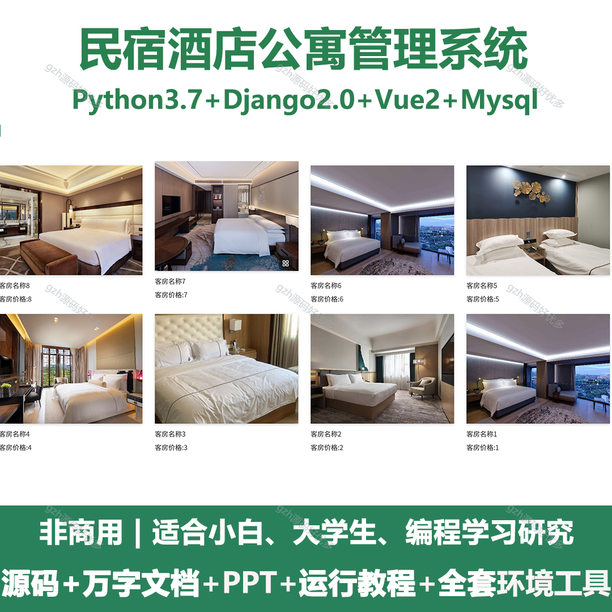
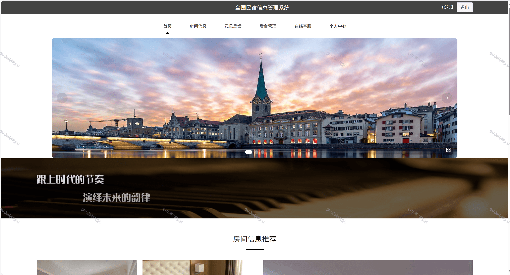
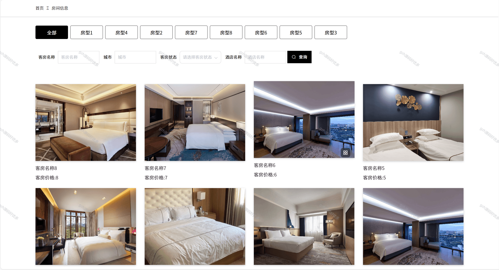
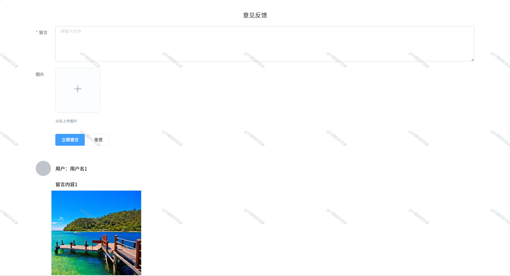
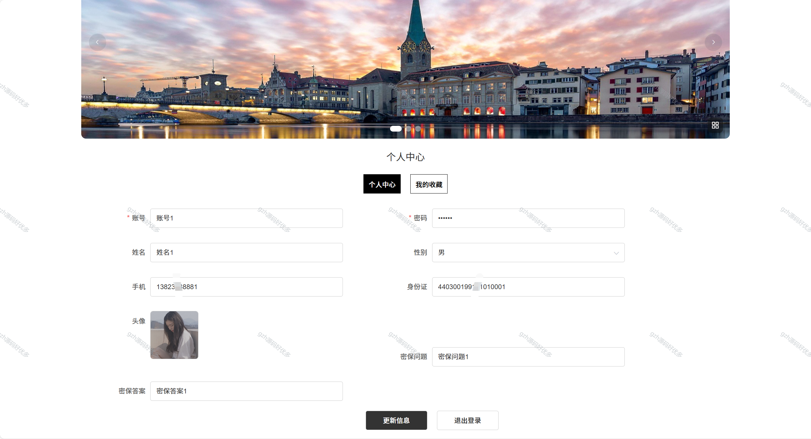
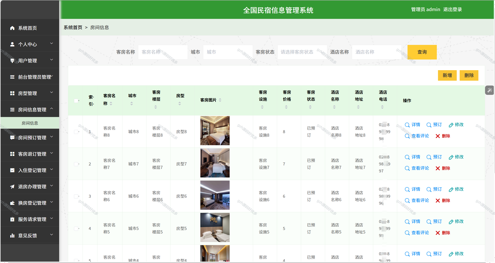
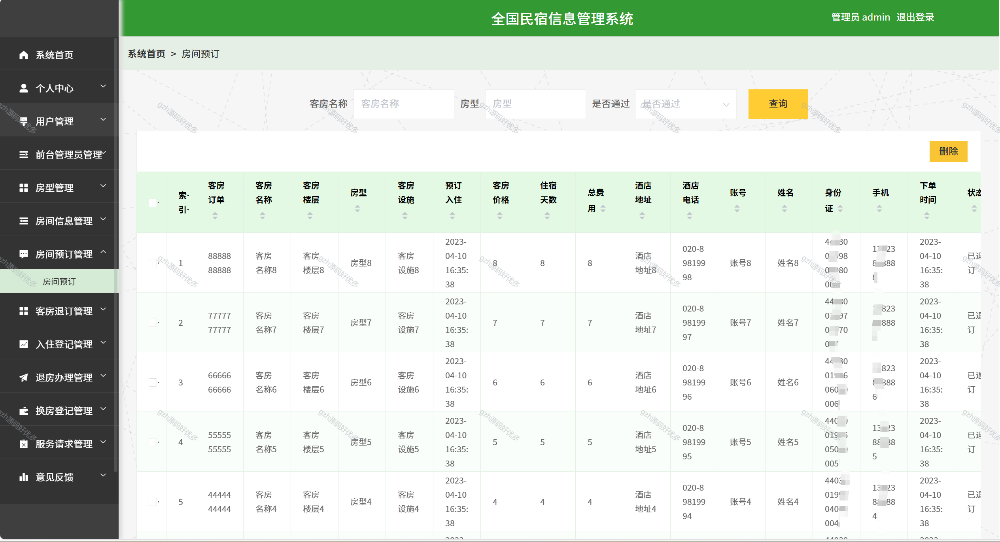
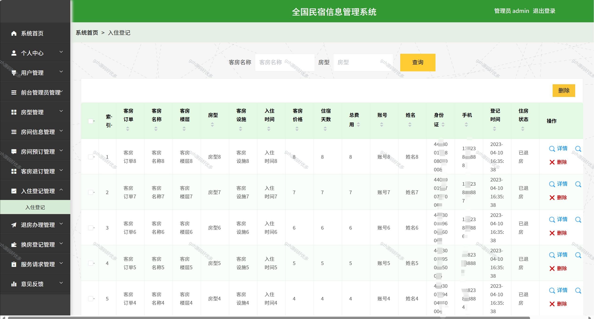
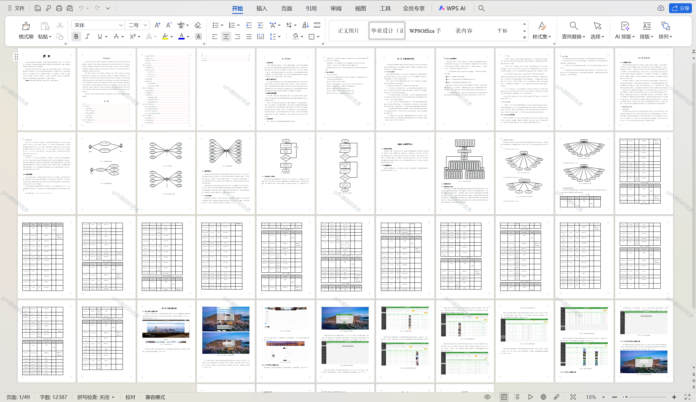

# python080
python080基于Python+Django的民宿酒店公寓管理系统+LW+PPT
 
## 查看主页获取源码

### 一、关键词
住宿业管理系统，短租公寓管理系统，民宿酒店综合管理系统

### 二、作品包含
源码+数据库+设计文档万字+PPT+全套环境和工具资源+本地部署教程

### 三、项目技术
前端技术：Vue2.0、Element-ui
后端技术：Python3.7、Django2.0

### 四、运行环境（以下版本亲测，其他版本兼容性请自行测试）
开发工具：PyCharm + VSCODE

数据库：MySQL5.7（最低要5.7版本）

数据库管理工具：Navicat10+

Python：Python3.7

前端Nodejs：14

浏览器：谷歌浏览器

### 五、项目介绍
项目编号：python080

全国民宿信息管理系统利用计算机网络实现信息化管理，使整个全国民宿信息管理的发展和服务水平有显著提升。
系统拥有管理员和用户、前台管理员三个角色，主要具备注册登录、个人信息修改、用户信息、前台管理员信息、房间信息、房间预订、客房退订、入住登记、退房办理、换房登记、服务请求等功能模块。将纸质管理有效实现为在线管理，极大提高工作效率。

### 六、运行截图

